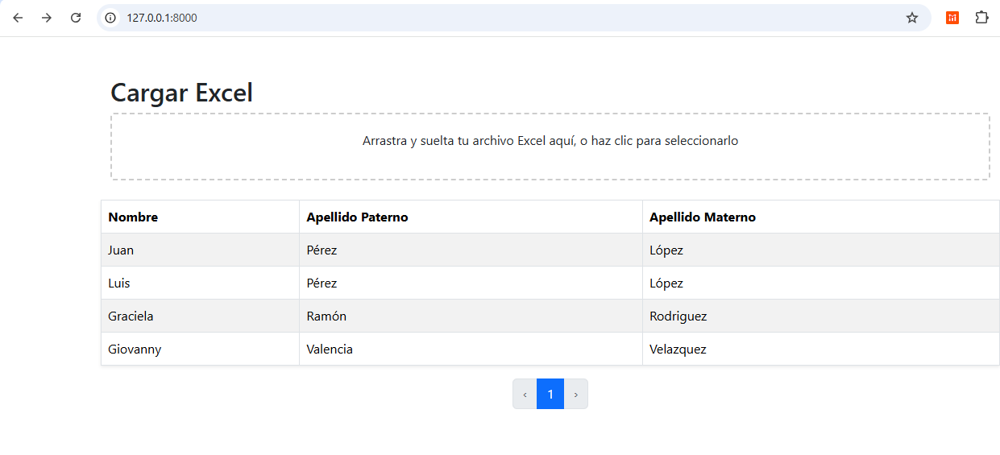

# Proyecto de Carga Masiva de Excel a Base de Datos

Este proyecto fue desarrollado como parte del examen técnico solicitado, el cual consiste en cargar un archivo Excel (o CSV), procesarlo y migrar la información a una base de datos estructurada, usando Laravel y MySQL.

---

## 📌 Detalles del proyecto

- **Framework:** Laravel 10.x
- **Base de datos:** MySQL
- **Carga de archivo:** Archivos .xlsx o .csv
- **Librerías utilizadas:** Laravel, Bootstrap, y funcionalidades nativas de PHP para manejo de base de datos y archivos.

---

## ¿Cómo funciona?

1. El usuario puede arrastrar o seleccionar un archivo Excel.
2. El archivo se convierte en `.csv` si es necesario.
3. Se carga en una tabla temporal (`temp_excel_data`) mediante `LOAD DATA LOCAL INFILE`.
4. Se ejecuta un procedimiento almacenado llamado `migrar_datos` para distribuir la información en las tablas: `personas`, `telefonos` y `direcciones`.
5. Se muestra un resumen de los datos migrados.

---

## Consideraciones Técnicas

- Por motivos de tiempo y carga laboral, el proyecto fue realizado en tiempos libres, lo cual impidió completar el apartado final del examen.
- Se utilizó **acceso directo a base de datos con DB::select y PDO**.
- La base de datos fue creada manualmente con **scripts SQL tradicionales**. Puedes encontrarlos en la carpeta `bd/`.
- No se utilizó Elequent en este proyecto, pero estoy familiarizado con su uso y no tengo inconvenientes en retomarlo en un entorno productivo.
- Aunque tengo un tiempo sin trabajar directamente con Laravel, no me es un tema ajeno. Utilicé mis conocimientos actuales para resolver el examen de la manera más eficiente posible.

---

## Vista previa de la interfaz

A continuación se muestra una captura de la interfaz de carga de Excel y visualización de datos paginados:

